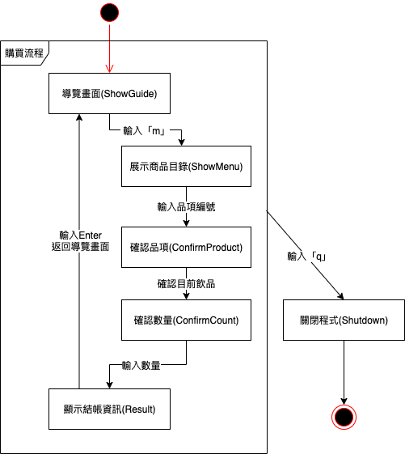
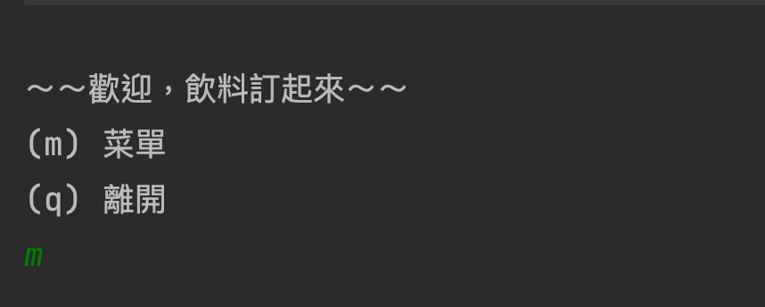
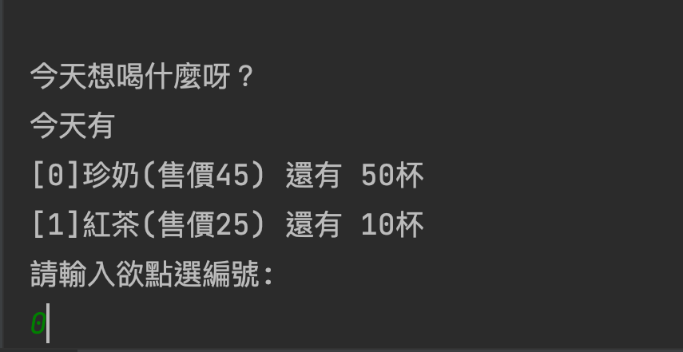
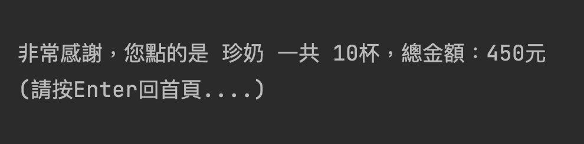
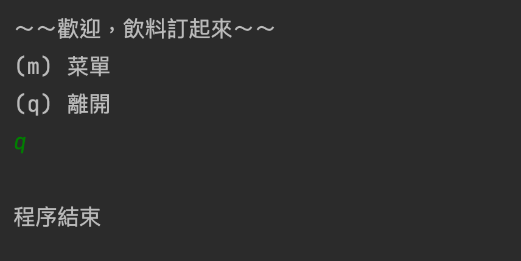
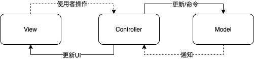
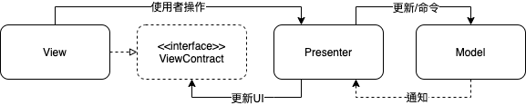
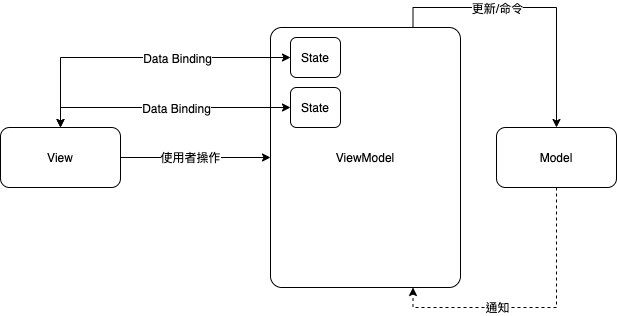

# ArchitecturePlayground

ArchitecturePlayground是一個解釋架構演進的 Java project，由無架構演進至MVVM的過程，使用無架構與MVC、MVP、MVVM 三種框架實作飲料販賣機，並根據架構特點進行說明。建議搭配原始碼註解與不同的階段的框架介紹進行閱讀。


## 目錄
1. [飲料販賣機](#vendor)
	1.1. [流程](#vendor-process)
	1.2. [畫面](#vendor-screen)
	1.3. [職責](#vendor-responsible)
2. [無架構 (no_arch)](#no_arch)
	2.1. [Convention (開發慣例)](#Convention)
3. [MVC (Model-View-Controller)](#MVCModel-View-Controller)
	3.1. [View](#MVC-View)
	3.2. [Controller](#MVC-Controller)
	3.3. [Model](#MVC-Model)
4. [MVP(Model-View-Presenter)](#MVPModel-View-Presenter)
	4.1. [Contracting](#Contracting)
		4.1.1. [PassiveView](#PassiveView)
		4.1.2. [Supervising Controller](#SupervisingController)
	4.2. [View](#MVP-View)
	4.3. [Presenter](#MVP-Presenter)
	4.4. [Model](#MVP-Model)
5. [MVVM(Model-View-ViewModel)](#MVVMModel-View-ViewModel)
	5.1. [PresentationModel](#PresentationModel)
	5.2. [View](#MVVM-View)
	5.3. [ViewModel](#MVVM-ViewModel)
	5.4. [Model](#MVVM-Model)


##  1. <a name='vendor'></a>飲料販賣機

實作飲料販賣機，可以查看飲料品項，指定欲訂購的飲品後確認購買數量進行結帳，結帳後可回退至導覽畫面。


###  1.1. <a name='vendor-process'></a>流程

根據要求設計出以下流程：




###  1.2. <a name='vender-screen'></a>畫面

|     流程     | 實際畫面                                                     |
| :----------: | :----------------------------------------------------------- |
|   導覽畫面   |  |
| 展示商品目錄 |  |
|   確認品項   |  |
|   確認數量   |  |
| 顯示結帳資訊 |  |
|   關閉程式   |  |


###  1.3. <a name='vender-responsible'></a>職責

在開始解釋架構前我們須釐清販賣機中有哪些職責。

|    職責    | 解釋                                                         |
| :--------: | ------------------------------------------------------------ |
| 使用者操作 | 根據不同階段販賣機接收到使用者的操作會有相對應的行為，如展示商品目錄時需輸入代號、確認數量時輸入數量。 |
|  顯示邏輯  | 每一流程階段，販賣機展示不同的詢問文字，也會根據販賣機的邏輯回饋訊息。 |
|  程式狀態  | 販賣機會紀錄目前狀態，使得後續的輸入與輸出流程得以進行，如紀錄使用者先前確認的品項，於結帳時得以辨識出購買商品。 |
|  業務邏輯  | 販賣機有許多的業務邏輯，如商品已全數售罄時，需通知介面提示使用者商品已全數售出、輸入未預期事件需通知介面提示使用者輸入正確資訊。 |
|  數據載入  | 當販賣機載入時須讀取後台的商品資料，來源可能是API或是裝置的硬碟。 |
|  資料控制  | 在進行結帳時，會根據使用者的輸入的數量扣除庫存數量，也可以查看目前剩餘的商品數量。 |


##  2. <a name='no_arch'></a>無架構 (no_arch)

準確來說程式並非一定要使用主流的架構(MVP、MVVM) 才能使專案進行，基本上只要堅守團隊的Convention與Coding Style，彼此也能夠按時交付需求，這邊所提的無架構指的是未能將職責明確地從單一程式分離而形成的God Class，更甚者系統上大部分的資訊集中於此類別造成邏輯肥大，以此牽扯出一連串的程式碼品質問題。


* 不易於閱讀
* 不易於維護
* 不易於測試


###  2.1. <a name='Convention'></a>Convention (開發慣例)

透過團隊內在邏輯規劃或命名規則彼此協定出的開發習慣，讓維護、開發、重構時都能夠依循著某一套標準進行，專案的開發會一直不斷的疊代需求，在初期單純使用Convention進行過渡是可行的，但隨著專案日漸龐大，總會有需要調整的規則，總有需要移除的活動，甚至人員的流動造成需求不可考。這些邏輯問題耦合於龐大的邏輯中，修改起來是相當的費力，不但要先釐清邏輯脈絡，修改時還需當心是否影響到舊有的邏輯。


販賣機開發使用的慣例：

1. 使用者輸入

   當使用者有任何的操作邏輯，將集中撰寫在 onUserInput 這個區塊

```java
/**使用者操作*/
private void onUserInput(String input) {
  input = input.trim();
  if ("q".equals(input)) {
    state = State.Shutdown;
    onShutdown();

  } else if (state == State.ShowGuide) { //根據販賣機狀態接受input
    if ("m".equals(input)) {
      state = State.ShowMenu; //使用者操作後根據販賣機邏輯，改變販賣機狀態
      onShowMenu();
    } else {
      onInvalidInput(); //當發生未預期輸入時，通知介面提示使用者異常操作
    }

  } else if (state == State.ShowMenu) {
         ...
}
```


2. 進入販賣機狀態邏輯命名

   進入販賣機的指定狀態所執行的邏輯，將會以on+{State}命名，如onShowGuide、onShutdown

```java
private void onShowMenu() {
  boolean isAllProductSoldOut = true;
  for (Product product : productList) {
    if (product.getRemainCount() > 0) {
      isAllProductSoldOut = false; 
      break;
    }
  }
  if (isAllProductSoldOut) {
    showMessage("\n抱歉商品已售罄\n"); //根據販賣機邏輯，顯示提示訊息
    state = State.ShowGuide; //因商品全數售出，狀態回退至顯示導覽頁
  }
}
```


3. 顯示流程訊息(UI)

   當顯示主要流程的UI邏輯時，將會以show+{State}命名，如showGuide、showConfirmProduct

```java
/**顯示UI*/
private void showGuide() {
   StringBuilder stringBuilder = new StringBuilder();
   stringBuilder.append("\n～～歡迎，飲料訂起來～～\n");
   stringBuilder.append("(m) 菜單\n");
   stringBuilder.append("(q) 離開");
   showMessage(stringBuilder.toString());
}
```


##  3. <a name='MVCModel-View-Controller'></a>MVC (Model-View-Controller)

最為最初代的架構，透過 **關注點分離(Separation of Concerns)**，將程式畫分出三個區塊，彼此各司其職，相互協作。有了基本的架構分離我們可以獲得一些好處，程式碼概念已被分離，單一類別的程式邏輯減少，使得程式更加容易閱讀理解; 再將職責分離後，可複用各層的邏輯，減少程式碼與開發成本，分配邏輯時團隊可以更有效率的分配工作。

* 易於維護
* 不重新造輪子
* 方便協作





###  3.1. <a name='MVC-View'></a>View

將邏輯中通知使用者操作與UI展示邏輯分離到View層，在這一層中只需要專注在UI的輸入輸出，當中包含的職責：

* 如何顯示Controller更新內容
* 搜集操作事件並通知Controller

```java
/** View */
private final Monitor monitor;
private final Keyboard keyboard;

/** UI元件 螢幕 */
public class Monitor {

  public void showMessage(String message) {
    System.out.println(message);
  }
}

/** UI元件 鍵盤 */
public class Keyboard {

  private final Scanner scanner = new Scanner(System.in);

  public String input() {
    return scanner.nextLine();
  }
}
```


###  3.2. <a name='MVC-Controller'></a>Controller

Controller所扮演的角色為View與Model之間協調資料傳遞的角色，是MVC中職責最重的角色，當中包含的職責：

* 處理View搜集的使用者操作
* 調用Model進行複雜操作
* 根據業務邏輯決定後續流程
* 管理程式狀態
* 決定View顯示內容

```java
/** 程式狀態 */
private State state = State.ShowGuide;
private Product selectedProduct = null;
private int selectedCount = 0;

/** View */
private final Monitor monitor;
private final Keyboard keyboard;

/** Model */
private final VendorModel vendorModel;

private void startApplication() {
  isRunning = true;
  while (isRunning) {
    ...

    String input = keyboard.input(); // View 通知接收到的訊息

    onUserInput(input); // 根據收到的訊息Controller進行後續處理
  }
}

...
  
private void onShowMenu() {
  Call<Boolean> isNoProductRemain = vendorModel.isNoProductRemain(); // Model執行商品數量的確認
  if (isNoProductRemain.get()) { // 通知結果，由Controller決定後續流程
    monitor.showMessage("\n抱歉商品已售罄\n");
    state = State.ShowGuide;
  }
}

...
  
private void showConfirmProduct(Product product) {
   StringBuilder stringBuilder = new StringBuilder();
   stringBuilder.append("\n您要的是 ");
   stringBuilder.append(product.getName());
   stringBuilder.append("(售價").append(product.getPrice()).append(")");
   stringBuilder.append("嗎?(y/n)");
   monitor.showMessage(stringBuilder.toString()); // View 顯示Controller交付的更新資料
}
...
```


###  3.3. <a name='MVC-Model'></a>Model

掌管專門的邏輯，一般Model所執行的任務大多是耗時與被動的，當中包含的職責：

* 執行耗時計算
* 只在被Controller所呼叫才得以執行
* 完成的結果以通知的方式，回覆給Controller

```java
/**
 * 啟動程式時取得商品資訊
 */
public void initialize() {
  initializeProducts();
}

private void initializeProducts() { 
  Product p1 = new Product();
  p1.setName("珍奶");
  p1.setPrice(45);
  p1.setRemainCount(50);
  Product p2 = new Product();
  p2.setName("紅茶");
  p2.setPrice(25);
  p2.setRemainCount(10);
  productList.add(p1); // 這裡的載入的位置是一個List，但在實務上可能會保存於Database
  productList.add(p2);
}

/**
 * 取得編號商品
 */
public Call<Product> getProduct(int index) {
  return new Call<Product>() { // 由於在大多的情況下，Model的工作是耗時的，所以提供異步介面以供Model通知使用 

    @Override
    public Product get() {
      return productList.get(index);
    }

    @Override
    public void cancel() {
      //TODO cancel when background service working
    }
  };
}
```


##  4. <a name='MVPModel-View-Presenter'></a>MVP(Model-View-Presenter)

在MVC的架構上我們可以發現，Controller在框架上所扮演的角色職責太重了，最主要是因為Controller需要負責UI的顯示資訊，像是訊息、動畫、畫面倒轉等UI邏輯。因此提出透過Contracting的方式透過建立interface實現控制反轉(Inversion Of Control )，將關於UI的邏輯解耦。





###  4.1. <a name='Contracting'></a>Contracting

透過制定`Interface`來畫清職責的界線，View層會制定介面讓引用者可以很清楚的知道所以有View可展示的方法或元件。

```java
舉例，軟體工程師合約書
  1. JAVA
  2. SQL
  3. PYTHON
	
老闆 has a 軟體工程師
老闆 invoke 軟體工程師.JAVA();
老闆 invoke 軟體工程師.SQL();
老闆 invoke 軟體工程師.幫老闆去接小孩(); //不行因為合約上沒有寫
```


而定義Contracting根據View的掌控程度可以區分為 PassiveView、Supervising Controller


####  4.1.1. <a name='PassiveView'></a>PassiveView

定義需求畫面上所有元件由Presenter控制顯示邏輯

```java
//舉例
interface OrderView{ //Contract

  TextView getTextOrderName();//帳單名稱

  ImageView getTextProductImage();//商品圖片

  TextView getTextProductName();//商品名稱

  TextView getTextProductDescribe();//商品說明

  ListView getListViewPurchaseCart();//購物車清單

  Button getButtonPurchase();//結帳按鈕
}

public class OrderViewImpl implement OrderView{
		
  TextView getTextOrderName(){ //帳單名稱
    return findViewById(R.id.textOrderName);
  }

  ImageView getTextProductImage(){ //商品圖片
    return findViewById(R.id.textProductImage);
  }

  ...
}
```


####  4.1.2. <a name='SupervisingController'></a>Supervising Controller

展示業務層的結果，包含取用業務資料的邏輯被封裝在View層，Presenter只需要呼叫View曾提供的展示功能

```java
interface OrderView { //Contract

  void 顯示帳單(帳單 bill);
		
  void 顯示購物車(購物車 purchaseCart);
		
  void 顯示商品明細(商品 product);
}

public class OrderViewImpl implement OrderView{
		
  @Override
  public void 顯示帳單(帳單 bill){
    ...
  }
		
  @Override
  void 顯示購物車(購物車 purchaseCart){
    ...
  }
		
  @Override
  void 顯示商品明細(商品 product){
    ...
  }
}
```


理解Contracting的意義後就可以分析MVP個曾所代表的職責


###  4.2. <a name='MVP-View'></a>View

在專案中我使用Supervising Controller 作為實現Contracting的方法，當中所包含的職責：

* 綁定與移除綁定Presenter

* 訂定Contract內容提供可使用的展示功能給Presenter
* 根據Presenter呼叫的展示功能顯示模板內容
* 搜集操作事件並通知Presenter

```java
/**View Contract*/
public interface VendorView {

  void showGuide(); 

  ...
}

/**View Contract Implement*/
public class VendorViewImplement implements VendorView {

  /** UI元件 */
  private final Monitor monitor = new Monitor();
  private final Keyboard keyboard = new Keyboard();
	
  /** Presenter */
  private final VendorPresenter presenter;

  private boolean isRunning = false;

  public VendorViewImplement(VendorPresenter presenter) {
    this.presenter = presenter; // 綁定Presenter以供後續接收到使用者操作後呼叫
  }
  
  private void startApplication() {
    presenter.bindView(this); // 綁定 presenter
    isRunning = true;
    while (isRunning) {
      presenter.showCurrentState();
      String input = keyboard.input();
      presenter.onUserInput(input);
    }
    presenter.unBindView(); // 解除綁定 presenter
  }

  ...
    
  /** 顯示UI */
  @Override
  public void showGuide() { // View擁有了展示訊息的模板
    StringBuilder stringBuilder = new StringBuilder();
    stringBuilder.append("\n～～歡迎，飲料訂起來～～\n");
    stringBuilder.append("(m) 菜單\n");
    stringBuilder.append("(q) 離開");
    monitor.showMessage(stringBuilder.toString());
  }

  ...
}
```


###  4.3. <a name='MVP-Presenter'></a>Presenter

比起Controller移除了大量UI訊息，使此時的Presenter職責更專注在數據邏輯的傳遞，而使用上需特別注意是否已綁定View，以避免NullPointerException問題，當中所包含的職責：

* 調用Model進行複雜操作
* 根據業務邏輯決定後續流程
* 管理程式狀態
* 綁定與移除綁定View

```java
public class VendorPresenter {

  ...
  /**程式狀態*/
  private State state = State.ShowGuide;
  private Product selectedProduct = null;
  private int selectedCount = 0;
  
  /**View*/
  private VendorView vendorView;

  /**Model*/
  private final VendorModel vendorModel;

  VendorPresenter(VendorModel vendorModel) {
     this.vendorModel = vendorModel;
  }

  /**綁定View*/
  public void bindView(VendorView vendorView) {
    this.vendorView = vendorView;
  }

  /**解除綁定View*/
  public void unBindView(){
    this.vendorView = null;
  }

  /**看目前階段畫面*/
  public void showCurrentState() {
    if (state == State.ShowGuide) {
      vendorView.showGuide(); // 呼叫View Contract上的展示功能
      
    } else if (state == State.ShowMenu) {
       ...
    }

    /**使用者輸入介面*/
    public void onUserInput(String input) { // 接收View傳遞過來的UserInput
	...
    }
    ...
    
}
```


###  4.4. <a name='MVP-Model'></a>Model

與MVC的Model職責完全相同


##  5. <a name='MVVMModel-View-ViewModel'></a>MVVM(Model-View-ViewModel)

在MVP中我們發現了，使用Contracting實現View層提供展示功能的需求，在使用的過程中發現，每當某項資源被更新後，伴隨而來畫面更新的元件總是那幾個，此時我們發現到UI元件與資料的關係，因此透過觀察者模式(ObserverPattern)實現View層的元件(Observer)觀測ViewModel的資料狀態(Observerable)，每當資料變化時就更新相對應元件，透過PresentationModel的概念，讓View與ViewModel間的耦合程度進一步降低。





###  5.1. <a name='PresentationModel'></a>PresentationModel

透過View層元件觀測數據進而更新UI。所有的UI顯示狀態應該已PresentationModel所保留的狀態為主，如下圖AlbumTitle會去比照PresentationModel去顯示目前的Album。


###  5.2. <a name='MVVM-View'></a>View

根據PresentationModel的概念，使用ObserverPattern綁定數據，並且根據通知資訊進行UI更新，當中所包含的職責：

* 綁定與移除綁定PresentationModel

* 根據通知資訊更新已綁定UI
* 搜集操作事件並通知ViewModel

```java
...
/** ViewModel State 觀察者 */
private final Observer<StateEvent> stateEventObserver = value -> { //接收狀態事件，根據事件更新畫面
  if (value instanceof ShutdownEvent) {
    showShutdown();
  } else if (value instanceof ShowGuideEvent) {
    showGuide();
  } else if (value instanceof ShowMenuEvent) {
    ShowMenuEvent event = (ShowMenuEvent) value;
    showMenu(event.getItems());
  } else if (value instanceof ConfirmProductEvent) {
    ConfirmProductEvent event = (ConfirmProductEvent) value;
    showConfirmProduct(event.getProductName(), event.getProductPrice());
  } else if (value instanceof ConfirmCountEvent) {
    ConfirmCountEvent event = (ConfirmCountEvent) value;
    showConfirmCount(event.getProductName());
  } else if (value instanceof ResultEvent) {
    ResultEvent event = (ResultEvent) value;
    showResult(event.getProductName(), event.getCount(), event.getTotalPrice());
  }
};

/** ViewModel Error 觀察者 */
private final Observer<ErrorEvent> errorEventObserver = value -> { // 接收錯誤事件，並根據事件種類更新UI
  if (value instanceof InvalidInputErrorEvent) {
    alertInvalidInput();
  } else if (value instanceof LessThanZeroErrorEvent) {
    alertLessThanZero();
  } else if (value instanceof MoreThanRemainCountErrorEvent) {
    MoreThanRemainCountErrorEvent event = (MoreThanRemainCountErrorEvent) value;
    alertMoreThanRemainCount(event.getProductRemain());
  } else if (value instanceof AllProductEmptyErrorEvent) {
    alertAllProductEmpty();
  }
};

/** 綁定ViewModel狀態 */
private void bindViewModel() {
  vendorViewModel.stateEvent.addObserver(stateEventObserver); //綁定數據
  vendorViewModel.errorEvent.addObserver(errorEventObserver);
}

/** 解除綁定ViewModel狀態 */
private void unbindViewModel() {
  vendorViewModel.stateEvent.removeObserver(stateEventObserver); //移除數據綁定
  vendorViewModel.errorEvent.removeObserver(errorEventObserver);
}
...
```


###  5.3. <a name='MVVM-ViewModel'></a>ViewModel

不同於Controller與Presenter，ViewModel完全不知道View的存在，他的更新手段是直接更新數據，都過數據更新通知更新View層的元件，當中所包含的職責有：

* 調用Model進行複雜操作
* 根據業務邏輯決定後續流程
* 管理程式狀態
* 管理對外數據狀態

```java
/** 程式狀態 */
private State state = State.ShowGuide;
private Product selectedProduct = null;
private int selectedCount = 0;

/** Model */
private final VendorModel vendorModel;

/** 對外發送更新事件 */
public final Observable<StateEvent> stateEvent = new Observable<>();
public final Observable<ErrorEvent> errorEvent = new Observable<>();

VendorViewModel(VendorModel vendorModel) {
  this.vendorModel = vendorModel;
  syncCurrentState();
}

/** 根據內部狀態，設定ViewModel對外狀態 */
private void syncCurrentState() {
  if (state == State.ShowGuide) {
    stateEvent.setValue(new ShowGuideEvent()); //發現狀態為ShowGuideEvent即為販賣機結束

  } else if (state == State.ShowMenu) {
    Call<List<Product>> servingProducts = vendorModel.getServingProducts();
    List<Product> products = servingProducts.get();
    ShowMenuEvent event = new ShowMenuEvent(); //根據不同狀態產生不同的事件
    for (Product product : products) {
      MenuItem item = new MenuItem();
      item.setName(product.getName());
      item.setPrice(product.getPrice());
      item.setRemainCount(product.getRemainCount());
      event.addMenuItem(item);
    }
    stateEvent.setValue(event);

  } else if (state == State.ConfirmProduct) {
  ...
}

/** 使用者操作 */
public void onUserInput(String input) {
  input = input.trim();
  if ("q".equals(input)) {
    state = State.Shutdown;

  } else if (state == State.ShowGuide) {
    if ("m".equals(input)) {
      onShowMenu();
    } else {
      onInvalidInput();
    }

  } else if (state == State.ShowMenu) {
  ...

  syncCurrentState(); //同步程式狀態與對外狀態
}
```


###  5.4. <a name='MVVM-Model'></a>Model

與MVC的Model職責完全相同
